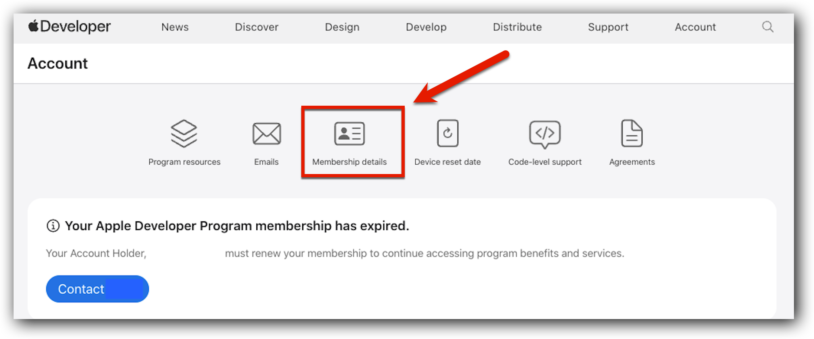

# Apakah akun Apple Developer yang sudah expired masih bisa diaktifkan kembali?

---

## Apa yang Terjadi Saat Akun Apple Developer Expired?

Ketika keanggotaan Apple Developer Anda habis masa berlakunya:

- Aplikasi Anda akan menjadi **tidak tersedia** untuk diunduh di App Store.
- Aplikasi akan menghilang dari hasil pencarian hingga keanggotaan diperbarui.
- Anda tidak dapat mengirimkan pembaruan aplikasi baru atau membuat aplikasi baru.

---

## Cara Memperbarui Keanggotaan (Renewal)

Jika Anda menemukan aplikasi hilang dari App Store, kemungkinan besar keanggotaan developer telah habis. Berikut langkah-langkah untuk memperbaruinya:

1. **Login:**  
   Kunjungi [Apple Developer Account](https://developer.apple.com/account/) dan masuk menggunakan kredensial pemilik akun (*Account Holder*).

2. **Pilih Opsi Renewal:**  
   - Klik banner yang muncul di atas **"Program resources"**, atau  
   - Klik ikon **"Membership details"** di bagian atas halaman.

   

3. **Ikuti Instruksi:**  
   Lanjutkan proses pembayaran dan konfirmasi pembaruan keanggotaan.

> **Catatan:** Setelah proses pembaruan selesai, aplikasi Anda akan tersedia kembali untuk diunduh dalam waktu sekitar **24 jam**.

---

## Aktifkan Auto-Renew

Disarankan untuk mengaktifkan fitur **Auto-Renew Membership**.  
Dengan mengaktifkan fitur ini (centang kotak yang tersedia), Anda tidak perlu lagi memantau tanggal kedaluwarsa secara manual karena sistem akan memperbarui secara otomatis.

---

## Kendala Umum: "Your Apple ID is already associated..."

Saat mencoba mendaftar ulang atau memperbarui akun, Anda mungkin menemui pesan error berikut:

> *"Sorry, you can’t enroll at this time. Your Apple ID is already associated with the Account Holder of a membership."*

Hal ini biasanya terjadi jika Anda memiliki riwayat keanggotaan developer di masa lalu (bahkan jika sudah lama tidak digunakan).

### Solusi

Anda tidak perlu mendaftar akun baru.  
Cukup kunjungi:

https://developer.apple.com/account/

Login menggunakan Apple ID lama Anda, lalu lakukan proses pembaruan (renewal) dari sana.

---

## Informasi Penting: Regulasi EU (DSA)

Berlaku mulai **16 Oktober 2024**, semua pengembang aplikasi yang terdaftar di App Store harus mendeklarasikan status **"trader"** untuk mematuhi Undang-Undang Layanan Digital Uni Eropa (EU Digital Services Act).

- Pelanggan Custom App harus memutuskan apakah akan mendeklarasikan sebagai trader di EU App Store untuk melanjutkan pengiriman pembaruan aplikasi.
- Jika tidak mendeklarasikan, hal ini dapat mempengaruhi kemampuan untuk mengirim update aplikasi di wilayah Uni Eropa.

---

## Sumber Referensi & Video

- **Video Tutorial:**  
  [How to renew my Apple Developer Program Account after it has expired?](https://www.youtube.com/watch?v=QUltgAPP6Fw)

- **Video Terkait:**  
  [What Happens When Your Apple Developer Account EXPIRES?](https://www.youtube.com/watch?v=oBN_6Ji0_gc)

- **Artikel Bantuan:**  
  [How to Renew an Expired Apple Developer Membership (Pushpay Support)](https://support.pushpay.com/s/article/How-to-Renew-an-Expired-Apple-Developer-Membership)

- **Pengalaman Pengguna:**  
  [Renewing an expired Apple developer account (xsleonard.com)](https://www.xsleonard.com/renewing-an-expired-apple-developer-account/)

---

## Tautan Terkait

- [D-U-N-S Number Information](https://developer.apple.com/help/account/membership/D-U-N-S)
- [Apple ID Management](https://idmsa.apple.com/)
- [Diskusi Apple](https://discussions.apple.com/thread/255783716?sortBy=rank)
